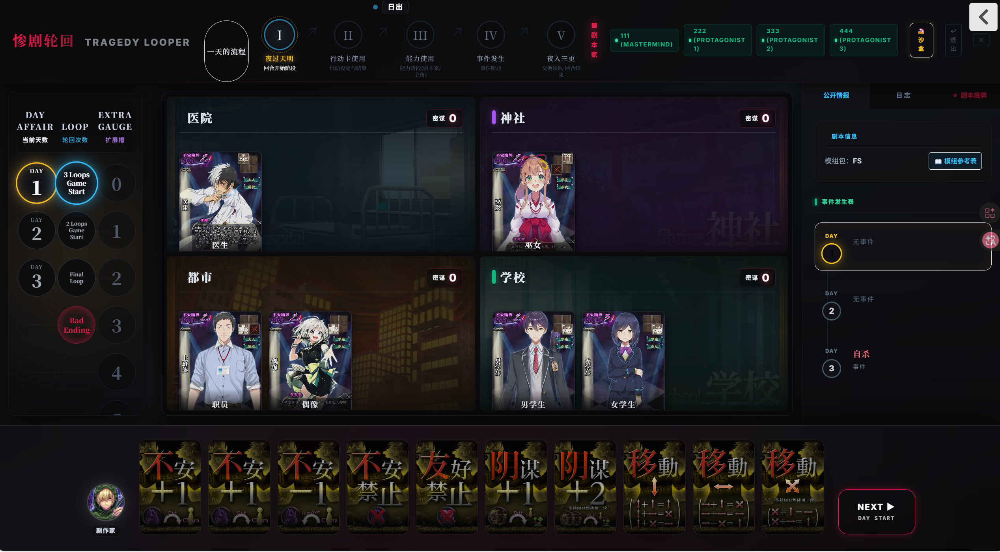

# 🎭 惨剧轮回 Online — Tragedy Looper Web Simulator

<p align="center">
  
  
  
</p>

<p align="center">
  <strong>全模组 · 在线多人 · 半自动结算 · 开源</strong>
</p>

<p align="center">
  <a href="./README_EN.md">English</a> ·
  <a href="#快速启动">快速启动</a> ·
  <a href="#功能特色">功能特色</a> ·
  <a href="#技术架构">技术架构</a>
</p>

---

<p align="center">
  
</p>

基于 [boardgame.io](https://boardgame.io/) 构建的 **《惨剧轮回》(Tragedy Looper)** 桌游在线模拟器。支持 2-4 人实时对局，覆盖所有官方扩展模组，提供半自动结算引擎。

> 《惨剧轮回》是 BakaFire 设计的推理桌游：剧作家操纵角色制造惨剧，主角团通过时间轮回揭开真相。

## ✨ 功能特色

### 🎮 游戏核心
- **完整的 Phase 状态机**：日出 → 出牌 → 结算 → 能力 → 事件 → 日落，全流程闭环
- **半自动结算引擎**：自动计算效果，但关键选择交由玩家决定
- **座位级信息隔离**：剧作家与主角各自只能看到权限范围内的信息
- **2-4 人变体规则**：自动适配出牌数、牌组、队长轮换

### 📦 模组支持
全部 **8 个官方模组 + 十周年扩展** 100% 规则覆盖：

| 模组                 | 门禁    | 模组                         | 门禁      |
| -------------------- | ------- | ---------------------------- | --------- |
| First Steps (FS)     | ✅ 35/35 | Basic Tragedy X (BTX)        | ✅ 126/126 |
| Mystery Circle (MC)  | ✅ 39/39 | Haunted Stage Again (HSA)    | ✅ 24/24   |
| Weird Mythology (WM) | ✅ 23/23 | Midnight Zone (MZ)           | ✅ 37/37   |
| Last Liar (LL)       | ✅ 6/6   | Another Horizon Revise (AHR) | ✅ 12/12   |

### 🎴 引擎能力
- 行动卡结算引擎：17+4 张卡注册，4 步优先级结算
- 十周年扩展底层引擎：希望之光、碰撞降级、Ex 牌等全链路
- 友好能力引擎：30+ 角色能力自动结算
- 事件系统：含群众事件独立判定路径
- 剧作家控制台：快照、隐藏身份、轮回状态管理

### 🖥️ 前端交互
- 阻塞式结算面板：卡牌翻转动画 + 逐步展示结算过程
- 信息侧边栏：角色手风琴、能力交互、事件时间线
- 剧作家能力面板：强制 / 可选能力分级处理
- 事件发生表：历史事件状态追踪（已发生 / 未发生 / 免疫）

## 📁 项目结构

```
├── packages/
│   ├── domain/            领域数据层 — 类型、角色、阴谋、剧本、模组定义
│   ├── game-logic/        游戏逻辑层 — boardgame.io Game 定义 (moves/phases/状态机)
│   └── rules/             规则校验层
├── apps/
│   ├── server/            后端 — boardgame.io 多人服务器 (port 8000)
│   └── tl-simulator/      前端 — Vite + React SPA (port 5173)
│       └── public/assets/ 游戏资产 — 卡面、立绘、皮肤、token
└── scripts/               构建、测试、审计脚本
```

## 🚀 快速启动

> **环境要求**：Node.js ≥ 22 · npm ≥ 11

```bash
# 克隆仓库
git clone https://github.com/losinphantom/tragedy-looper-web.git
cd tragedy-looper-web

# 安装依赖
npm install --legacy-peer-deps

# 启动后端 (port 8000)
npm run serve --workspace=apps/server

# 新终端 — 启动前端 (port 5173)
npm run dev --workspace=apps/tl-simulator
```

打开 http://localhost:5173 进入游戏大厅 🎉

## 🎲 游戏流程

```
1. 剧作家创建房间 → 选择模组和剧本
2. 主角玩家加入房间（支持 2-4 人）
3. 按阶段推进：
   日出 → 出牌 → 行动卡结算 → 剧作家能力 → 事件判定 → 日落
4. 轮回结束 → 最终猜测 → 判定胜负
```

## ⚙️ 技术架构

| 层   | 技术                                                            |
| ---- | --------------------------------------------------------------- |
| 前端 | React 19 · Vite 6 · Tailwind CSS 3 · Framer Motion · TypeScript |
| 后端 | boardgame.io Server · Socket.IO · vite-node                     |
| 共享 | npm workspaces monorepo · ESM · Vitest                          |

**架构理念**：
- **纯状态机**：游戏逻辑是纯粹的状态转换，不依赖浏览器 API
- **数据驱动**：规则效果由领域层数据定义，引擎不硬编码业务逻辑
- **前后端共享**：`packages/` 下的代码在前后端同时使用

## 🧪 开发

```bash
# 运行全量测试
npm test

# 类型检查
npm run typecheck

# 生产构建
npm run build --workspace=apps/tl-simulator
```

## 🛠️ 待完善功能

- [ ] 进一步完善 2-4 人变体的边界规则、出牌限制与队长轮换细节
- [ ] 提升多模组兼容性，补齐特殊规则、EX 槽与扩展内容的联动验证
- [ ] 支持自定义导入剧本，提供更稳定的脚本校验、预览与落库流程
- [ ] 持续扩展剧本特殊规则支持，减少需要手工裁定的例外情况
- [ ] 优化沙盒模式，增强状态编辑、快照调试与测试体验
- [ ] 增加录像回放功能，支持按阶段回看对局流程与关键结算节点
- [ ] 增加观众模式，支持非对局玩家旁观并遵守信息可见性限制
- [ ] 增加聊天框系统，支持房间内实时沟通与基础消息管理
- [ ] 持续改进复杂结算场景下的前端反馈、日志可读性与新手引导

## 📜 License

MIT

## 🙏 致谢

- 《惨剧轮回》作者：BakaFire、NEKOG(紺ノ玲)
- http://bakafire.main.jp/rooper/sr_dl_04_sozai.htm
- [boardgame.io](https://boardgame.io/) — 游戏引擎框架
